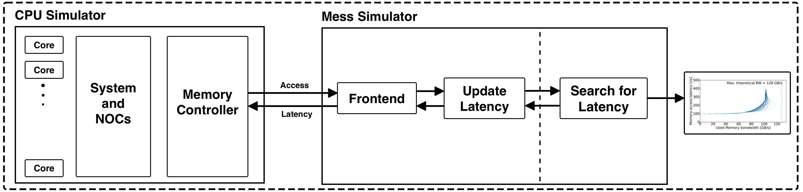

# Mess-Simulator: Integrated Version

<i>Figure 1: Structure of the Integrated Simulator. [EXPLAIN]</i>

Mess simulators is an abstract memory model based on bandwidth--latency curves. It matches the peroformance of the main memory to the input bandwidth--latency curves. The input bandwidth--latency curves can be obtained by running Mess benchmark on actual hardware or recieved from memory manufacturer, e.g. based on their detailed hardware model. 

Currenty Mess simulator is integrated with the following CPU simulators:

- ZSim as a representative of event-based simulator. This directory is the integration done during Mess study.  
- gem5 as a representative of cycle-accurate simulator
- OpenPiton Metro-MPI as a representative of RTL simulator
- ZSim+Standalone as a representative of event-based simulator. This repository is updated version of ZSim directory. We keep this dircotry updated as we update the standalone version. We strongly suggest ZSim users to use this integration to avoid misconfiguration. The original integration has some values hardcoded that can lead to wrong evaluation. 

