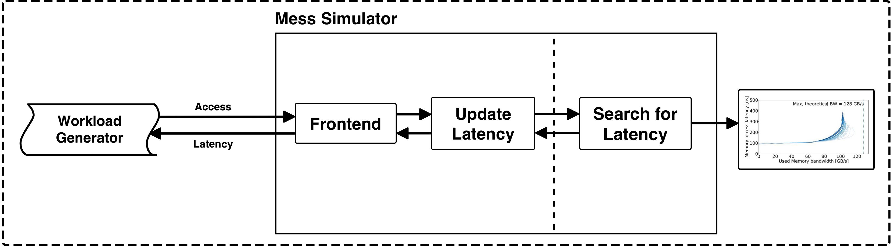
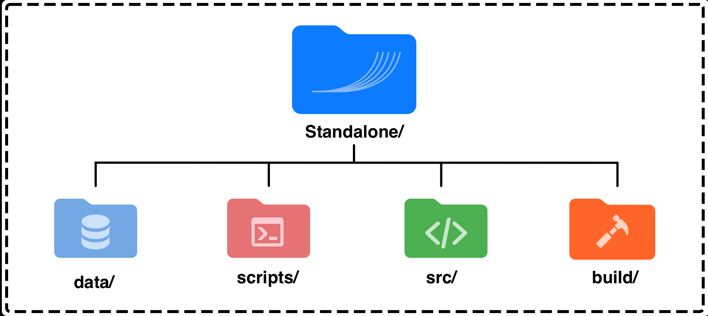

# Mess-Simulator: Standalone Version

## Contents
  [1. Overview](#1-overview) \
  [2. Directory Organization](#2-directory-organization) \
  [3. Simulation Parameters](#3-simulation-parameters) \
  [4. Build and Run](#4-build-and-run) \
  [5. Example Outputs](#5-example-outputs) 

---

## 1. Overview

### What is the Standalone Mess Simulator?
The standalone simulator is part of the **Mess Simulation**, a key component within the **Mess Framework**. It provides a streamlined environment for evaluating memory performance using pre-characterized bandwidth-latency curves. This simulator enables users to understand the memory behavior in isolation, without requiring integration into larger CPU or system simulators.

<p align="center"></p>
<p align="center"><i>Figure 1: Structure of the Standalone Mess Simulator. The Workload Generator interacts with the Mess Simulator, leveraging measured bandwidth-latency curves to evaluate performance.</i></p>

The standalone version is designed to help users grasp the core principles of the Mess Simulation and provides an essential starting point for exploring memory system performance across different technologies.

#### Key Features
- Functions independently of full-system simulators, enabling focused exploration of memory performance.
- Supports multiple memory technologies, including DDR4, DDR5, HBM2, and CXL.
- Relies on measured bandwidth-latency curves to model memory system behavior under diverse conditions.
- Provides a straightforward interface for programs to evaluate memory performance.

#### How Does it Work?

The standalone simulator leverages **bandwidth-latency curves** as its primary input. These curves encapsulate the relationship between memory traffic intensity and system performance, derived from real-world measurements or detailed hardware simulations. 

Programs interact with the simulator through the following process:
1. Specify memory access parameters, such as traffic intensity, CPU frequency, and curve selection.
2. Run simulations to assess memory behavior, observing how latency and bandwidth adjust under varying conditions.

This lightweight, analytical approach ensures both speed and accuracy, making it an essential tool for evaluating memory technologies prior to full system deployment.

---

## 2. Directory Organization

<p align="center"></p>
<p align="center"><i>Figure 2: Structure of the Standalone Simulator and its main components.</i></p>

#### ```data/```
This directory contains measured **bandwidth-latency curves** for various memory technologies and CPUs, such as DDR4, DDR5, HBM2, and CXL. These curves serve as input to the simulator, capturing memory performance characteristics under different conditions.

- The `data/` directory is continuously updated with new curves.  
- If you wish to create your own curves, refer to **[Curve Generation Guide](#link-to-guide)** or use the **Mess Framework’s benchmarking tools** to measure them directly on your hardware.

#### ```scripts/``` 
This folder contains pre-defined scripts to run experiments for various memory configurations. 

- These scripts are ready-to-use and designed for specific architectures, making it easy to start simulations without additional setup.
  - For example, run the DDR4 experiment with:  
    ```bash
    bash scripts/ddr4-exp.sh
    ```
- If you want to modify these scripts or create custom configurations, refer to the **README in the `scripts/` directory** for detailed instructions.

#### ```src/``` 
This directory contains the source files of the Mess Standalone simulator.

- **`mess_mem_ctrl.cpp`** and **`mess_mem_ctrl.h`** implement the simulator's main functionality.
- **`example.cpp`** serves as an example file, demonstrating how to set up and use the simulator.

Refer to the code in `src/` if you wish to customize the simulator or integrate it into other systems.


#### ```build/``` 
This directory is not included in the git but will be created during compilation.

- It will contain the compiled executable for the simulator, which can be used to run simulations:
  ```bash
  ./build/mess_example
    ```

Ensure you have compiled the simulator with ``make`` first before running any experiments. To build the simulator go to [4. Build and Run](#4-build-and-run)

---

## 3. Simulation Parameters

The Mess simulator requires several input parameters to model memory behavior accurately. Here’s an explanation of each:

#### Parameters

1. ```<curve_path>```:
    - Path to the memory bandwidth-latency curve file (e.g., ./data/skylake-ddr4).
    - These curves describe memory performance under varying traffic intensities.
2. ```<pause_value>```:
    - Controls the memory issue rate.
    - Smaller values simulate higher bandwidth, while larger values simulate lower bandwidth.
3. ```<frequencyCPU>```:
    - Frequency of the simulated CPU in GHz.
    - From ns to cpu cycles, we need it. [REWRITE]
4. ```<onChipLatency>```:
    - The latency (in nanoseconds) from the CPU core to the memory controller.
    - Subtracted from the curve values to isolate memory controller-to-main-memory latency.

#### How It Works

1. The Mess simulator processes the bandwidth-latency curves and adjusts latency values based on the provided CPU frequencies.
2. It simulates memory requests using the **MessMemCtrl** class, calculating latency and bandwidth for each configuration.
3. Outputs include:
    - **Latency (in nanoseconds)**: Calculated based on CPU frequency and curve data.
    - **Bandwidth (in GB/s)**: Determined by the issue rate and pause value.

---

## 4. Build and Run

### Building the Standalone Mess Simulator
To build the Standalone Mess simulator, ensure that you have all necessary dependencies installed (e.g., a C++ compiler and GNU Make). From the `Standalone/` directory, run:

```bash
make
```

This command compiles the simulator and generates an executable in the ```build/``` directory. By default, the compiled program is based on the **example program** located in ```src/example.cpp```.


##### About the Example Program

The example program demonstrates the core functionality of the Mess simulator, including how to:

1. Use bandwidth-latency curves from the data/ directory as input.
2. Simulate memory behavior for a specific configuration (e.g., DDR4 at a given CPU frequency).
3. Output key metrics, such as latency and bandwidth, for various pause values.

The example program runs read operations over multiple iterations and uses the MessMemCtrl class to model memory system behavior. Users can modify this file to experiment with different workloads, configurations, or technologies.

#### Running the Simulator

Once compiled, you can run the simulator in two ways:

##### 1. Using Pre-Defined Scripts

The scripts/ folder contains ready-to-use scripts for specific memory configurations. For example:
```bash
bash scripts/ddr4-exp.sh
```

These scripts:
- Automatically compile the simulator (if not already compiled).
- Set up key parameters (e.g., pause, frequencyCPU).
- Run the simulator across a range of configurations.

##### 2. Manual Execution

Alternatively, you can run the simulator directly using the executable:
```bash
./build/mess_example <curve_path> <pause_value> <frequencyCPU> <onChipLatency>
```

For example:
```bash
./build/mess_example ./data/skylake-ddr4 20000 2.1 51
```

---

## 5. Example Outputs

The Mess simulator outputs latency (ns) and bandwidth (GB/s) for each run. Here’s an example output for DDR4 with different pause values:

```txt
90.00 ns, 67.20 GB/s
50835.71 ns, 134.40 GB/s
50916.19 ns, 192.00 GB/s
50945.71 ns, 268.80 GB/s
50967.14 ns, 448.00 GB/s
```

#### Interpreting the Results

1. Latency: As bandwidth utilization increases, latency generally rises. For example:
    - At 67.20 GB/s, the latency is 90.00 ns.
    - At 448.00 GB/s, the latency increases significantly to 50967.14 ns.
2. [REWRITE] Bandwidth Saturation:
    - When the issued bandwidth exceeds the memory system’s maximum capacity (e.g., 116 GB/s for DDR4), latency spikes drastically.
    - This behavior reflects realistic memory system constraints, where excessive traffic leads to queuing delays.


####  Notes
- Experiment with different pause values to explore how the memory system responds under varying loads.
- Use the pre-defined scripts for a faster, guided exploration of results across a wide range of configurations.
- Modify the example program (src/example.cpp) to include write operations or test new workloads.
