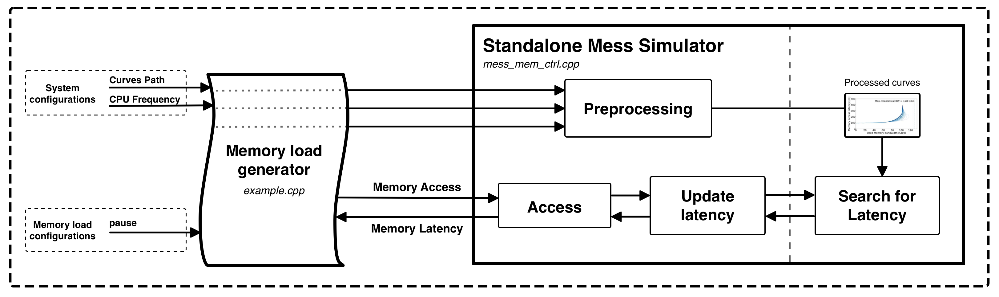

# Mess-Simulator: Standalone Version

## Contents
  [1. Overview](#1-overview) \
  [2. Simulation Parameters](#3-simulation-parameters) \
  [3. Directory Organization](#2-directory-organization) \
  [4. Build and Run](#4-build-and-run) \
  [5. Example Outputs](#5-example-outputs) 

---

## 1. Overview

### What is the Standalone Mess Simulator?
The Standalone Mess Simulator is a simplified tool for evaluating memory performance based on measured memory bandwidth-latency curves. It is part of the broader Mess Simulation framework, detailed in the [Mess Paper](https://arxiv.org/abs/2405.10170).


<p align="center"></p> <p align="center"><i>Figure 1: Overview of the Standalone Mess Simulator. The Workload Generator initialize the Mess Standalone Simulator with input configuration values. Then, it interacts with the Mess Standalone Simulator, by sending memory accesses and receiving their memory access latencies.</i></p>

This simulator is designed for standalone use, allowing users to study memory behavior without the complexity of integrating it into larger CPU or system simulators.


#### Key Features
- Functions independently of full-system or cpu simulators, enabling focused exploration of memory performance.
- Supports multiple memory technologies, including DDR4, DDR5, HBM2, and CXL.
- Relies on measured memory bandwidth-latency curves.

#### How Does it Work?
The simulator evaluates memory performance through the following steps:

1. **Input Configuration:** Users specify memory access parameters such as traffic intensity, CPU frequency, and bandwidth-latency curve selection.
2. **Simulation Execution:** The simulator runs simulations based on the input parameters, modeling how memory latency and bandwidth behave under different conditions.
<p align="center"></p> <p align="center"><i>Figure 2: Internal structure of the Standalone Mess Simulator. This detailed view expands the Mess Simulator block to illustrate its main levels: workload handling, curve-based modeling, and memory response evaluation.</i></p>

---

## 2. Simulation Parameters

The Mess simulator requires several input parameters to model memory behavior accurately. These need to be given to the function calls made from the load generator. Here’s an explanation of each:

#### Parameters

1. ```<curve_path>```:
    - Path to the memory bandwidth-latency curve file (e.g., ./data/skylake-ddr4).
    - The simulator will use this curve as a reference
2. ```<pause_value>``` [REWRITE]:
    - Controls the memory issue rate.
    - Smaller values simulate higher bandwidth, while larger values simulate lower bandwidth.
3. ```<frequencyCPU>```:
    - Frequency of the simulated CPU in GHz.
    - Used to convert the timing data from nanoseconds (ns) in the curves to cycles, as simulators operate on a per-cycle basis.
4. ```<onChipLatency>```:
    - The latency (in nanoseconds) from the CPU core to the memory controller.
    - Subtracted from the curve values to isolate memory controller-to-main-memory latency.

#### How It Works

1. The Mess simulator processes the memory bandwidth-latency curves and adjusts latency values based on the provided CPU frequency and onChipLatency.
2. It simulates memory requests using the **MessMemCtrl** class, calculating latency and bandwidth for each configuration.
3. Outputs are made up of:
	- **Bandwidth (in GB/s)**: Determined by the issue rate and pause value.
    - **Latency (in nanoseconds)**: Calculated based on CPU frequency and curve data.


---

## 3. Directory Organization

<p align="center"></p>
<p align="center"><i>Figure 3: Structure of the Standalone Simulator and its main components.</i></p>

#### ```data/```
This directory contains measured memory **bandwidth-latency curves** for various memory technologies and CPUs, such as DDR4, DDR5, HBM2, and CXL. These curves serve as input to the simulator.

- The `data/` directory is continuously updated with new curves.  
- If you wish to create your own curves, refer to **[Mess Benchmark](https://github.com/bsc-mem/Mess-benchmark)** to measure them directly on your hardware.

#### ```scripts/``` 
This folder contains pre-defined scripts to run experiments for various memory configurations. 

- These scripts are ready-to-use and designed for specific architectures, making it easy to start simulations without additional setup.
  - For example, run the DDR4 experiment with:  
    ```bash
    bash scripts/ddr4-exp.sh
    ```
- If you want to modify these scripts or create custom configurations, refer to the **README in the `scripts/` directory** for detailed instructions.

#### ```src/``` 
This directory contains the source files of the Mess Standalone simulator.

- **`mess_mem_ctrl.cpp`** and **`mess_mem_ctrl.h`** implement the simulator's main functionality.
- **`example.cpp`** serves as an example file, demonstrating how to set up and use the simulator.

Refer to the code in `src/` if you wish to customize the simulator or integrate it into other systems.

#### ```build/``` 
This directory is not included in the git but will be created during compilation.

- It will contain the compiled executable for the simulator, which can be used to run simulations:
  ```bash
  ./build/mess_example
    ```

Ensure you have compiled the simulator with ``make`` first before running any experiments. To build the simulator go to Section [4. Build and Run](#4-build-and-run)


---

## 4. Build and Run

### Building and Running the Standalone Mess Simulator

The Standalone Mess Simulator can be built and executed in two ways: **Manual Execution** and **Automatic Execution**. Choose the approach that suits your needs.

---

### **1. Manual Execution**

#### **Building the Simulator**

To manually build the simulator, ensure that all necessary dependencies (e.g., a C++ compiler and GNU Make) are installed. From the `Standalone/` directory, run:

```bash
make
```

This command compiles the simulator and creates an executable in the `build/` directory. By default, the compiled program is based on the **example program** located in `src/example.cpp`.

#### **Running the Simulator**

Once compiled, you can run the simulator directly using the executable. Use the following format:

```bash
./build/mess_example <curve_path> <pause_value> <frequencyCPU> <onChipLatency>
```

Example:
```bash
./build/mess_example ./data/skylake-ddr4 20000 2.1 51
```

- `<curve_path>`: Path to the bandwidth-latency curve file.
- `<pause_value>`: Pause cycles between memory requests.
- `<frequencyCPU>`: CPU frequency in GHz.
- `<onChipLatency>`: On-chip latency in nanoseconds.

---

### **2. Automatic Execution**

For ease of use, pre-defined scripts are provided to automate the build and execution process. These scripts compile the simulator (if necessary) and run it with pre-configured parameters.

#### **Using Pre-Defined Scripts**

Scripts are located in the `scripts/` directory. Run a script for your desired configuration, such as DDR4:

```bash
bash scripts/ddr4-exp.sh
```

The scripts:
- Automatically compile the simulator if it hasn’t been built yet.
- Set up and pass parameters like pause cycles, CPU frequency, and on-chip latency.
- Execute the simulator across a range of pre-defined configurations.

---

### About the Example Program

The example program (`src/example.cpp`) demonstrates the simulator’s core functionality, including:

1. Reading bandwidth-latency curves from the `data/` directory.
2. Simulating memory behavior for specific configurations (e.g., DDR4 at a given CPU frequency).
3. Outputting key metrics such as latency and bandwidth for varying pause values.

The program models read operations over multiple iterations and uses the `MessMemCtrl` class for memory system behavior. Users can modify this program to explore different workloads, configurations, or technologies.

---

## 5. Example Outputs

The Mess simulator outputs latency (ns) and bandwidth (GB/s) for each run. Here’s an example output for DDR4 with different pause values:

```txt
67.20 GB/s, 90.00 ns
134.40 GB/s, 50835.71 ns
192.00 GB/s, 50916.19 ns
268.80 GB/s, 50945.71 ns
448.00 GB/s, 50967.14 ns
```

#### Interpreting the Results

1. Latency: As bandwidth utilization increases, latency generally rises. For example:
    - At 67.20 GB/s, the latency is 90.00 ns.
    - At 448.00 GB/s, the latency increases significantly to 50967.14 ns.

For further analysis of real hardware memory system behaviour please refer to the [Mess Paper](https://arxiv.org/abs/2405.10170).


####  Notes
- Experiment with different pause values to explore how the memory system responds under varying loads.
- Use the pre-defined scripts for a faster, guided exploration of results across a wide range of configurations.
- Modify the example program (src/example.cpp) to include write operations or test new workloads.
